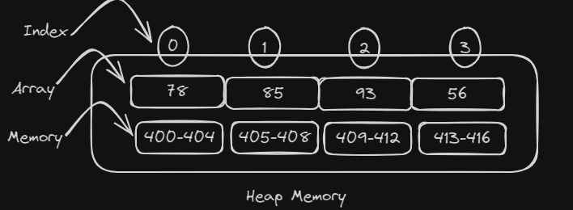
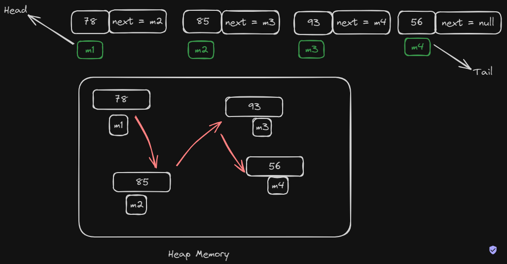

## What is a linked list?
- A linked list is a data structure used in computer science to organize and store data.
- Unlike arrays, ***linked lists do not store elements in contiguous memory locations***; instead, each element (node) in a linked list contains a **data field** and a **reference** (link or pointer) to the next node in the sequence.
- Linked lists provide dynamic memory allocation, as nodes ***can be easily inserted or removed*** without the need for resizing the entire data structure.

## Linked List vs Arrays
1. **Memory Allocation**

    - **Array:** Contiguous memory allocation. All elements are stored in adjacent memory locations, allowing for direct access using indexing.
    - **Linked List:** Non-contiguous memory allocation. Each element (node) contains a reference to the next node, and they may be scattered in different locations in memory.

2. **Dynamic vs Static size**

    - **Array:** Generally have a fixed size determined at the time of creation. Resizing an array can be an expensive operation.
    - **Linked List:** Can easily grow or shrink in size. Nodes can be dynamically allocated and deallocated, making them more flexible in terms of size changes.

3. **Insertion vs Deletion**

    - **Array:** Insertion or deletion of elements (except at the end) may require shifting or moving elements to maintain contiguous storage.
    - **Linked List:** Insertion and deletion can be done efficiently by adjusting pointers, without the need to move other elements. This makes linked lists preferable for frequent insertions or deletions.

4. **Access Time**

    - **Array:** Constant time access to elements using indexing (O(1) time complexity).
    - **Linked List:** Access time is proportional to the position of the element in the list, requiring traversal from the beginning in the worst case (O(n) time complexity).

5. **Memory Overhead**

    - **Array:** Typically have less memory overhead, as they only need space for the elements.
    - **Linked List:** Require additional memory for storing pointers/references, resulting in higher memory overhead.

6. **Traversal**

    - **Array:** Simple and efficient for sequential access using indices.
    - **Linked List:** Require sequential traversal from the head to reach a specific element.

7. **Usage Scenarios**

    - **Array:** Better suited for scenarios where random access and a fixed size are important, and the collection does not frequently change in size.
    - **Linked List:** Suitable when frequent insertions and deletions are expected, and the size of the collection may vary.

## Heap Memory representation of array vs linked list

**Array:**

**Linked List:**

***Head:***
- The "head" is the first node in the linked list.
- It holds the ***memory*** address (or reference) of the first node
- It serves as the starting point for traversing the list.
- The head contains the reference to the next node in the sequence.

***Tail***
- The "tail" is the last node in the linked list.
- It holds the ***memory*** address (or reference) of the last node
- It is the node whose next reference points to None or another sentinel value, indicating the end of the list.
- The tail is useful for efficient insertion at the end of the list.

## Where is a Linked List used?

- In Data structure, Used in Stacks and Queues
- Real Life Example: In a Browser - Backward and forward button